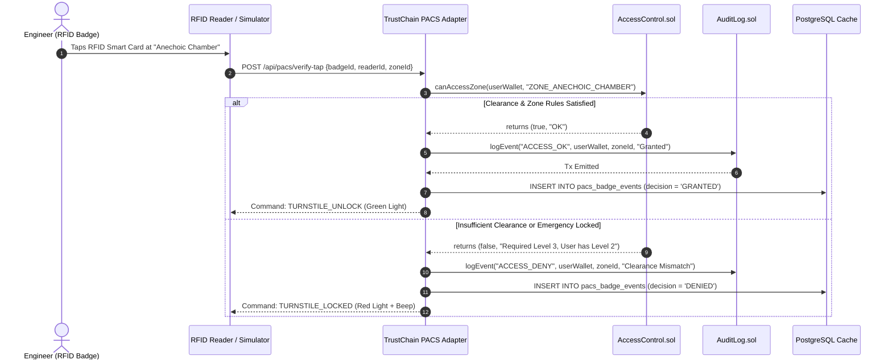
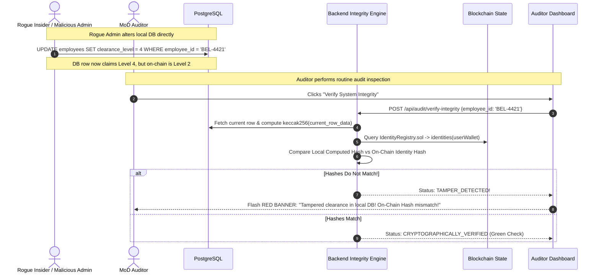

# TRUSTCHAIN — MASTER ARCHITECTURE & SPECIFICATION DOCUMENT
**Project**: TrustChain — Blockchain-Based Platform for Identity, Access Control & Digital Asset Management  
**Client / Stakeholder**: Bharat Electronics Limited (BEL) — Ministry of Defence, Govt. of India  
**Problem Statement**: SIH 26125 (Smart India Hackathon 2026)  
**Classification**: Restricted / Enterprise Architecture Specification  
**Version**: 1.0.0 (Production Blueprint)

---

## 1. Executive Summary & Domain Context

### 1.1 The Operational Challenge at BEL
Bharat Electronics Limited (BEL) operates across **9 manufacturing units** (Bengaluru, Ghaziabad, Hyderabad, Pune, Kotdwara, Panchkula, Chennai, Machilipatnam, Taloja) with mission-critical Strategic Business Units (SBUs) such as **Military Radars, Electronic Warfare & Avionics, Military Communication, and Cyber Security Systems**.

Currently, BEL tracks employee identities, security clearances, physical lab permissions, and high-value classified assets across separate centralized databases:
* **Active Directory / LDAP / Card-Issuer DB**: Central point of failure; if breached, all identities and clearance levels are vulnerable.
* **Physical Access Control (PACS) Gateways**: Enforced only at the application/middleware layer, which can be bypassed or silently doctored by privileged database administrators.
* **Departmental Spreadsheets & Paper Gate Passes**: Track custody of expensive tactical hardware (e.g., Software Defined Radios, Spectrum Analyzers, Crypto Modules) with no immutable custody provenance across units.
* **Compliance Auditing**: Internal/MoD auditors (DGQA, CAG, CERT-In) must rely on SQL rows that could have been modified before the audit.

### 1.2 The TrustChain Architectural Principle
TrustChain **does not rip-and-replace** BEL's existing HRMS, door badge readers, or SAP ERP. Instead, it introduces a **cryptographic, tamper-proof verification layer running quietly underneath**:
1. **Existing UI & Badge Readers Stay Intact**: Connected via the **TrustChain Integration Adapter API**.
2. **Blockchain as the Ultimate Authority**: Enforces rules, logs append-only events, and holds mathematical anchors.
3. **Encrypted IPFS as Decentralized Document Vault**: Preserves technical manuals, calibration reports, and employee dossiers without storing raw PII on-chain.
4. **PostgreSQL as Real-Time Query Cache**: Delivers sub-5ms search, sorting, and dashboard rendering, backed by cryptographic on-chain verification.

---

## 2. Roles & Permissions Architecture (RBAC & Clearance Tiers)

### 2.1 System Roles

```
                                [CISO / SUPER ADMIN]
                                         |
               +-------------------------+-------------------------+
               |                                                   |
      [SBU UNIT MANAGERS]                                   [AUDITORS]
 (Radars, EW, MilComm, Cyber)                        (MoD, DGQA, Internal Audit)
               |                                                   |
     [DEFENCE ENGINEERS / EMPLOYEES]                  (Read-Only Verifier Stream)
```

| Role | Target Persona at BEL | Key Responsibilities & Permissions |
| :--- | :--- | :--- |
| **`ROLE_SUPER_ADMIN` (CISO)** | Chief Information Security Officer / Enterprise IT Command | - Bulk employee onboarding & DID generation via HRMS feed.<br>- Facility access zone creation & clearance threshold assignment.<br>- Global Emergency Lockdown trigger (freezes turnstiles).<br>- Cryptographic identity revocation/quarantine. |
| **`ROLE_SBU_MANAGER`** | Unit Head / Project Director (e.g., Radar SBU Chief) | - Mints new Asset NFTs (equipment, test benches, crypto keys).<br>- Approves/rejects custody handover requests.<br>- Issues temporary zone access passes for contractors.<br>- Schedules calibration and maintenance events. |
| **`ROLE_AUDITOR`** | MoD Inspector / DGQA Auditor / Internal Vigilance | - Read-only access across all units and historical event logs.<br>- Verifies cryptographic proofs of past events.<br>- Runs the **Anti-Tamper Integrity Scanner** against local DB.<br>- Exports mathematically verified compliance dossiers. |
| **`ROLE_EMPLOYEE`** | Defence Scientist / Design Engineer / Field Tech | - Possesses unique DID and Digital Security Clearance Badge.<br>- Views checked-out equipment in "My Custody Locker".<br>- Initiates equipment handover/return requests.<br>- Taps virtual/physical RFID badge for lab door access. |
| **`ROLE_SYSTEM_CONNECTOR`** | Machine Identity (PACS Gateways / HRMS Adapter) | - Relayer identity authorized to submit automated badge scan events and HR sync transactions via backend custodial wallet. |

---

### 2.2 Security Clearance Hierarchy (Defence Protocol)

Access to physical zones and custody of sensitive assets is gated by four strict clearance tiers:

```
[LEVEL 4: TOP SECRET]    -> Crypto Key Lab, SCIF, Missile Firmware, KG Modules
         ^
[LEVEL 3: SECRET]        -> RF Anechoic Chamber, Radar Signal Labs, Tactical SDRs
         ^
[LEVEL 2: CONFIDENTIAL]  -> Sub-system Test Benches, Calibration Labs, VNA Analyzers
         ^
[LEVEL 1: RESTRICTED]    -> General Assembly, Non-sensitive Test Bays, Basic Tooling
```

* **Rule 1 (Access Gate)**: `User.clearanceLevel >= Zone.requiredClearance` (enforced on-chain).
* **Rule 2 (Custody Gate)**: `User.clearanceLevel >= Asset.classification` (enforced on-chain during mint & transfer).
* **Rule 3 (SBU Confinement)**: Certain high-security zones (e.g., *Electronic Warfare Cleanroom*) require matching SBU code unless a temporary cross-department pass is active.

---

## 3. Role-Based Dashboards & Feature Blueprint

```
+-----------------------------------------------------------------------------------------------+
|                      TRUSTCHAIN DASHBOARD NAVIGATION & ROLE SUITE                             |
+-----------------------------------------------------------------------------------------------+
| [BEL Crest]  TRUSTCHAIN CORE   |   [Switch Role: CISO Admin | SBU Manager | Auditor | Employee]|
+-----------------------------------------------------------------------------------------------+
```

### 3.1 Security Administrator Dashboard (CISO / Command)
* **High-Level Security Telemetry**:
  * Total DIDs Registered, Active Clearances by Tier (1–4), Total On-Chain Transactions, Smart Contract Status.
* **Bulk Employee Onboarding Station**:
  * Upload HRMS CSV / JSON file.
  * Preview generated DIDs (`did:bel:EMPxxxx`), cryptographic identity hashes (`keccak256`), and assigned clearance levels.
  * **"Execute Batch On-Chain Registration"** button (commits all records in one batch transaction).
* **Facility Access Zone Manager**:
  * Visual interactive map/grid of BEL Facility Zones (e.g., *Zone A: Anechoic Chamber*, *Zone B: Tactical Crypto Lab*, *Zone C: Radar Range*).
  * Configure required clearance level per zone.
  * **Emergency Lockdown Switch**: 1-click on-chain toggle that immediately invalidates turnstile access for that zone.
* **Quarantine & Revocation Station**:
  * Immediate revocation of any DID or badge; immediately propagates to all door readers.

---

### 3.2 SBU Manager Dashboard (Unit Head / Project Lead)
* **SBU Asset Inventory**:
  * Filterable table of all equipment owned by this SBU (Serial No., Asset Tag, Name, Current Custodian, Classification, Calibration Due Date).
* **Asset Minting Studio (Digital Twin Creation)**:
  * Form: Asset Name, Serial Number, Physical Barcode Tag, Classification Tier (1–4), Military Standard (e.g., MIL-STD-810G), Calibration Certificate (Upload PDF).
  * **Mint Asset NFT**: Automatically encrypts certificate, pins metadata to IPFS, and mints the custody token on-chain.
* **Custody Handover Handshake Hub**:
  * Incoming transfer requests from engineers.
  * Dual-authorization panel: Review recipient’s clearance level &rarr; Sign transfer approval &rarr; Custody moves on-chain.
* **Temporary Access Pass Issuer**:
  * Grant time-bound lab access (e.g., 4 hours for visiting DRDO scientist) by specifying `validUntil` timestamp.

---

### 3.3 Auditor Dashboard (MoD / DGQA Compliance) — *The Hackathon Showcase*
* **Live Immutable Audit Stream**:
  * Auto-updating feed of every event: `DID_REGISTERED`, `ACCESS_GRANTED`, `ACCESS_DENIED`, `ASSET_MINTED`, `CUSTODY_TRANSFERRED`, `EMERGENCY_LOCKDOWN`.
  * Each log displays: Timestamp, Actor Address, Target Address, Zone/Asset ID, Block Number, and clickable Etherscan (Sepolia) / Explorer TxHash link.
* **Advanced Filter & Export**:
  * Filter by Date Range, SBU, Employee ID, Event Type.
  * Export certified, cryptographically signed audit reports for defence compliance inspections.
* **⚡ Interactive Anti-Tamper Verification Lab (SIH Killer Feature)**:
  * Shows an off-chain asset or employee record side-by-side with its on-chain anchor.
  * **Button: "Simulate Insider Database Tamper"** (e.g., edits a PostgreSQL record to forge clearance from *Restricted* to *Top Secret*).
  * **Button: "Run Cryptographic Audit Check"**:
    * Recomputes `keccak256(current_db_row)`.
    * Queries the smart contract for the stored `identityHash` or `ipfsCID`.
    * **Result Display**: Flashes immediate red alert:
      `[!] CRITICAL ALERT: Database Row Tampered! Hash mismatch detected between PostgreSQL cache and Blockchain State Root!`

---

### 3.4 Employee / Defence Engineer Portal
* **Military Digital ID Credential**:
  * Interactive military-style ID card featuring Name, SBU, Clearance Level badge, and a dynamic QR code encoding the DID.
* **"My Custody Locker"**:
  * Cards showing all equipment currently possessed by this employee.
  * Shows serial number, calibration validity indicator (Green: Valid / Amber: Expiring / Red: Expired), and **"Initiate Return / Handover"** button.
* **Interactive Turnstile / PACS Badge Simulator**:
  * Interactive dropdown of BEL facility doors (*"RF Anechoic Chamber"*, *"Classified SCIF"*, *"EW Cleanroom"*).
  * **"Tap Badge at Reader"** button:
    * Simulates the physical RFID reader sending the badge tap to the backend.
    * Calls smart contract `canAccessZone()` in real time.
    * Displays simulated turnstile screen: `ACCESS GRANTED (Turnstile Unlocked)` or `ACCESS DENIED (Insufficient Clearance: Required Level 3, User has Level 2)`.
    * Shows the transaction written to the on-chain audit log.

---

## 4. Smart Contract Architecture (`blockchain/`)

The smart contract layer is written in Solidity (`^0.8.20`) using OpenZeppelin standards.

```
                      +-----------------------------+
                      |      AccessControl.sol      |
                      |   (Admin, Manager, Auditor) |
                      +--------------+--------------+
                                     |
             +-----------------------+-----------------------+
             |                                               |
+------------v------------+                     +------------v------------+
|   IdentityRegistry.sol  |                     |       AssetNFT.sol      |
|  - DID: did:bel:<id>    |                     |  - Soulbound/Custody 721|
|  - Hash-only on-chain   |                     |  - Equipment & HW keys  |
|  - Clearance Level      |                     |  - Custody history trail|
+------------+------------+                     +------------+------------+
             |                                               |
             +-----------------------+-----------------------+
                                     |
                      +--------------v--------------+
                      |        AuditLog.sol         |
                      |  - Append-only event index  |
                      |  - Tamper-proof verification|
                      +-----------------------------+
```

### 4.1 `IdentityRegistry.sol`
* **Purpose**: Anchors employee DIDs and identity hashes without exposing personal information.
* **Key Data Structures**:
  ```solidity
  struct IdentityRecord {
      bytes32 identityHash;  // keccak256(empId, fullName, sbuCode, salt)
      uint8 clearanceLevel;  // 1 to 4
      bytes32 sbuCode;       // "SBU_RADAR", "SBU_EW", etc.
      bool isActive;         // false = quarantined/revoked
      uint256 registeredAt;
      uint256 updatedAt;
  }
  mapping(address => IdentityRecord) public identities;
  mapping(string => address) public didToAddress;
  ```
* **Core Functions**:
  * `registerIdentity(address user, string memory did, bytes32 hash, uint8 clearance, bytes32 sbu)`
  * `batchRegisterIdentities(address[] users, string[] dids, bytes32[] hashes, uint8[] clearances, bytes32[] sbus)`
  * `updateClearance(address user, uint8 newClearance)`
  * `revokeIdentity(address user, string memory reason)`
  * `verifyIdentity(address user, bytes32 testHash) external view returns (bool)`

### 4.2 `AccessControl.sol`
* **Purpose**: Enforces physical and logical access permissions on-chain.
* **Key Data Structures**:
  ```solidity
  struct ZoneConfig {
      bytes32 zoneId;           // "ZONE_ANECHOIC_CHAMBER"
      uint8 requiredClearance;  // Minimum level (1-4)
      bytes32 allowedSBU;       // Specific SBU or "ALL"
      bool isLockedDown;        // Emergency freeze flag
  }
  mapping(bytes32 => ZoneConfig) public zones;
  mapping(address => mapping(bytes32 => uint256)) public tempPassExpiry;
  ```
* **Core Functions**:
  * `createZone(bytes32 zoneId, uint8 clearance, bytes32 allowedSBU)`
  * `grantTemporaryPass(address user, bytes32 zoneId, uint256 durationInSeconds)`
  * `toggleEmergencyLockdown(bytes32 zoneId, bool status)`
  * `canAccessZone(address user, bytes32 zoneId) external view returns (bool allowed, string memory reason)`

### 4.3 `AssetNFT.sol` (Soulbound / Restricted Custody ERC-721)
* **Purpose**: Represents physical defence hardware and tracks custody provenance.
* **Key Mechanics**: Overrides standard ERC-721 transfer functions so users cannot trade assets. Transfers are restricted to two-party authorized handovers signed by managers or custodians.
* **Key Data Structures**:
  ```solidity
  struct AssetDetails {
      string assetTag;          // "BEL-SDR-TAC-042"
      string serialNumber;      // "SN-99412-A"
      uint8 classificationTier; // 1 to 4
      string tokenURI;          // "ipfs://Qm..."
      uint256 mintedAt;
      bool isUnderMaintenance;
  }
  struct CustodyRecord {
      address custodian;
      uint256 timestamp;
      string transferReason;
      bytes signature;          // Cryptographic handshake proof
  }
  mapping(uint256 => AssetDetails) public assets;
  mapping(uint256 => CustodyRecord[]) public custodyHistory;
  ```
* **Core Functions**:
  * `mintAsset(address initialCustodian, string assetTag, string serialNumber, uint8 classification, string ipfsURI)`
  * `transferCustody(uint256 tokenId, address newCustodian, string reason)`
  * `setMaintenanceStatus(uint256 tokenId, bool inMaintenance)`
  * `getCustodyHistory(uint256 tokenId) external view returns (CustodyRecord[] memory)`

### 4.4 `AuditLog.sol`
* **Purpose**: Universal, unerasable event stream for all security operations.
* **Core Events**:
  ```solidity
  event SecurityAuditLog(
      bytes32 indexed eventType, // "DID_REG", "ACCESS_OK", "ACCESS_DENY", "ASSET_XFER", "LOCKDOWN"
      address indexed actor,
      address indexed target,
      bytes32 entityId,
      uint256 timestamp,
      string details
  );
  ```
* **Core Functions**:
  * `logEvent(bytes32 eventType, address actor, address target, bytes32 entityId, string details)` (Restricted to verified contract calls).

---

## 5. Triad Data Separation & Schema Architecture

```
+---------------------------------------------------------------------------------------------------+
|                                  THE DATA SEPARATION ARCHITECTURE                                  |
+---------------------------------------------------------------------------------------------------+

     [ ON-CHAIN (Solidity) ]                 [ IPFS (Encrypted) ]             [ POSTGRESQL (Cache) ]
    -------------------------               ----------------------           ------------------------
    - DID & Identity Hash                   - Encrypted Employee Dossier     - Full Name, Email, Phone
    - Clearance Level (1-4)                 - Asset Specifications JSON      - Employee Directory Index
    - Zone Access Rules & Expiry            - Calibration Certificates (PDF) - Zone Lists & Room Numbers
    - Asset Token ID & Custodian            - Technical Manuals / Schematics - Filterable Asset Inventory
    - Soulbound Custody Records             - Verifiable Credential Proofs   - Access Request History
    - Immutable Audit Log Events            - QA Inspection Sign-offs        - Cached PACS Badge Scans
```

### 5.1 On-Chain Data (Minimal Cryptographic State)
* **What**: Identity hashes, clearance levels (1–4), active/revoked flags, zone rules, token ownership, custody trails, and event hashes.
* **Why**: High gas efficiency, zero PII on-chain, 100% compliance with India’s Digital Personal Data Protection (DPDP) Act 2023.

### 5.2 IPFS Data (Encrypted Immutable Document Store)
* **What**: Large files, technical specifications, calibration certificates (PDFs), and encrypted employee dossiers.
* **Structure of `AssetMetadata.json` on IPFS**:
  ```json
  {
    "assetTag": "BEL-SDR-TAC-042",
    "name": "Tactical Software-Defined Radio Transceiver",
    "manufacturer": "Bharat Electronics Ltd - Kotdwara Unit",
    "militaryStandard": "MIL-STD-810G",
    "frequencyRange": "30 MHz - 512 MHz",
    "encryptedDossierCID": "ipfs://QmZtmD2q...",
    "calibrationCertCID": "ipfs://QmYwAPJzv...",
    "issuedDate": "2026-03-15",
    "nextCalibrationDue": "2027-03-15"
  }
  ```

### 5.3 PostgreSQL Data (Fast Query & Relational Cache)

#### Table: `employees`
```sql
CREATE TABLE employees (
    id SERIAL PRIMARY KEY,
    employee_id VARCHAR(50) UNIQUE NOT NULL,      -- "BEL-BLR-4421"
    did VARCHAR(100) UNIQUE NOT NULL,              -- "did:bel:EMP4421"
    wallet_address VARCHAR(42) UNIQUE NOT NULL,    -- "0x71C...3a9"
    full_name VARCHAR(100) NOT NULL,
    email VARCHAR(100) UNIQUE NOT NULL,
    phone VARCHAR(20),
    designation VARCHAR(100) NOT NULL,
    sbu VARCHAR(50) NOT NULL,                      -- "SBU_RADAR"
    unit VARCHAR(50) NOT NULL,                     -- "BENGALURU_COMPLEX"
    clearance_level INT NOT NULL CHECK (clearance_level BETWEEN 1 AND 4),
    status VARCHAR(20) DEFAULT 'ACTIVE',           -- 'ACTIVE', 'REVOKED', 'SUSPENDED'
    identity_hash VARCHAR(66) NOT NULL,            -- "0x9c4f8b..."
    ipfs_dossier_cid VARCHAR(100),
    on_chain_tx_hash VARCHAR(66),
    created_at TIMESTAMP DEFAULT CURRENT_TIMESTAMP,
    updated_at TIMESTAMP DEFAULT CURRENT_TIMESTAMP
);
```

#### Table: `facility_zones`
```sql
CREATE TABLE facility_zones (
    id SERIAL PRIMARY KEY,
    zone_id VARCHAR(50) UNIQUE NOT NULL,           -- "ZONE_ANECHOIC_CHAMBER"
    name VARCHAR(100) NOT NULL,                    -- "RF Anechoic Test Chamber"
    sbu VARCHAR(50) NOT NULL,                      -- "SBU_RADAR"
    unit VARCHAR(50) NOT NULL,                     -- "BENGALURU_COMPLEX"
    building VARCHAR(50) NOT NULL,
    room_number VARCHAR(20) NOT NULL,
    required_clearance INT NOT NULL CHECK (required_clearance BETWEEN 1 AND 4),
    is_emergency_locked BOOLEAN DEFAULT FALSE,
    created_at TIMESTAMP DEFAULT CURRENT_TIMESTAMP
);
```

#### Table: `assets`
```sql
CREATE TABLE assets (
    id SERIAL PRIMARY KEY,
    token_id INT UNIQUE,                           -- On-chain ERC-721 Token ID
    asset_tag VARCHAR(50) UNIQUE NOT NULL,         -- "BEL-SDR-TAC-042"
    serial_number VARCHAR(100) UNIQUE NOT NULL,
    name VARCHAR(150) NOT NULL,
    category VARCHAR(50) NOT NULL,                 -- "COMMUNICATION_HARDWARE", "TEST_EQUIPMENT"
    sbu VARCHAR(50) NOT NULL,                      -- "SBU_MILCOMM"
    current_custodian_id INT REFERENCES employees(id),
    classification_tier INT NOT NULL CHECK (classification_tier BETWEEN 1 AND 4),
    ipfs_metadata_cid VARCHAR(100) NOT NULL,
    ipfs_cert_cid VARCHAR(100),
    calibration_status VARCHAR(20) DEFAULT 'VALID',-- 'VALID', 'EXPIRING', 'EXPIRED'
    last_calibrated_at DATE,
    next_calibration_due DATE,
    is_under_maintenance BOOLEAN DEFAULT FALSE,
    mint_tx_hash VARCHAR(66),
    created_at TIMESTAMP DEFAULT CURRENT_TIMESTAMP
);
```

#### Table: `pacs_badge_events`
```sql
CREATE TABLE pacs_badge_events (
    id SERIAL PRIMARY KEY,
    reader_id VARCHAR(50) NOT NULL,                -- "READER-RF-CHAMBER-01"
    zone_id VARCHAR(50) REFERENCES facility_zones(zone_id),
    employee_id VARCHAR(50) REFERENCES employees(employee_id),
    decision VARCHAR(20) NOT NULL,                 -- "GRANTED", "DENIED"
    denial_reason VARCHAR(255),
    on_chain_tx_hash VARCHAR(66),
    block_number BIGINT,
    scanned_at TIMESTAMP DEFAULT CURRENT_TIMESTAMP
);
```

#### Table: `audit_events_cache`
```sql
CREATE TABLE audit_events_cache (
    id SERIAL PRIMARY KEY,
    event_type VARCHAR(50) NOT NULL,
    tx_hash VARCHAR(66) NOT NULL,
    block_number BIGINT NOT NULL,
    actor_address VARCHAR(42) NOT NULL,
    target_address VARCHAR(42),
    entity_id VARCHAR(66),
    details TEXT,
    timestamp TIMESTAMP NOT NULL,
    is_verified_on_chain BOOLEAN DEFAULT TRUE
);
```

---

## 6. End-to-End System Workflows

### 6.1 Workflow A: Employee Onboarding & DID Synchronization

```mermaid
sequenceDiagram
    autonumber
    actor Admin as CISO / Admin
    participant UI as Admin Dashboard
    participant API as Backend (Node.js)
    participant Enc as Encryption Service (AES-256)
    participant IPFS as IPFS Vault
    participant DB as PostgreSQL Cache
    participant Chain as IdentityRegistry.sol

    Admin->>UI: Upload HRMS Batch (CSV/JSON)
    UI->>API: POST /api/employees/batch-onboard
    API->>API: Generate DID & Keypair for Employee
    API->>Enc: Encrypt PII dossier with AES-256
    Enc->>IPFS: Upload encrypted dossier &rarr; Returns CID
    API->>API: Compute identityHash = keccak256(empId, name, sbu, salt)
    API->>Chain: batchRegisterIdentities([user], [did], [identityHash], [clearance], [sbu])
    Chain-->>API: Tx Confirmed (TxHash: 0x8a...4b)
    API->>DB: INSERT batch into `employees` table (stores CID, Hash, TxHash)
    API-->>UI: Onboarding Complete! DIDs Active on Chain.
```

---

### 6.2 Workflow B: Physical Turnstile Access (PACS Badge Tap)



---

### 6.3 Workflow C: Equipment Minting & Custody Handover

```mermaid
sequenceDiagram
    autonumber
    actor Mgr as SBU Manager
    actor Eng as Field Engineer
    participant UI as SBU Dashboard
    participant API as Backend API
    participant IPFS as IPFS Storage
    participant Chain as AssetNFT.sol
    participant DB as PostgreSQL Cache

    Mgr->>UI: Create Asset & Upload Calibration PDF
    UI->>API: POST /api/assets/mint
    API->>IPFS: Pin encrypted specs + calibration cert &rarr; CID
    API->>Chain: mintAsset(engWallet, "BEL-SDR-042", "SN-99412", tier=3, ipfsURI)
    Chain-->>API: Token #104 Minted & Custody assigned to Eng
    API->>DB: INSERT INTO assets (token_id=104, custodian_id=Eng.id, ipfs_cid=CID)
    API-->>UI: Asset Minted!

    Note over Mgr, Eng: Later: Custody Handover Handshake
    Eng->>UI: Request Transfer of Token #104 to Engineer B
    UI->>API: POST /api/assets/transfer-request
    API->>Chain: transferCustody(104, engB_Wallet, "Handover for Field Trial")
    Chain-->>API: Custody updated on-chain + CustodyRecord appended
    API->>DB: UPDATE assets SET current_custodian_id = EngB.id
    API-->>UI: Handover Complete! Chain of custody updated.
```

---

### 6.4 Workflow D: Auditor Anti-Tamper Verification (SIH Showstopper)



---

## 7. Scalability & Enterprise Production Feasibility

### 7.1 Wallet Abstraction (Zero MetaMask Friction for BEL Personnel)
* **The Problem**: Defence scientists and security guards cannot be expected to manage seed phrases, browser extensions (MetaMask), or gas tokens.
* **The Solution**:
  * The backend maintains a secure **Master Relayer Key** (secured via HSM / KMS in production).
  * Employees authenticate using their standard BEL Intranet credentials (Employee ID + PIN/OTP).
  * The backend signs and relays on-chain transactions on their behalf, mapping each action to their deterministic cryptographic address.

### 7.2 Migration Pathway to Production (Zero Redesign)

```
+-----------------------------------------------------------------------------------------------+
| PHASE 1: SIH DEMO (Now)          | PHASE 2: BEL PILOT (On-Prem)     | PHASE 3: NATIONAL (Prod)|
+----------------------------------+----------------------------------+-------------------------+
| - Network: Ethereum Sepolia Test | - Network: Hyperledger Besu      | - Network: NBF Vishvasya|
| - Fast, zero cost for demo       | - Permissioned, private BEL nodes|   Stack (NIC Data Ctrs) |
| - Cloud IPFS pinning (Pinata)    | - On-prem private IPFS cluster   | - Governed national node|
| - SQLite / PostgreSQL            | - Production Enterprise Postgres | - Mission-critical infra|
+----------------------------------+----------------------------------+-------------------------+
```

Because our smart contracts are written in standard EVM-compliant Solidity:
* **The exact same contract bytecode** runs on Ethereum Sepolia, on a local Hyperledger Besu network, or on the National Blockchain Framework.
* Migrating from demo to production requires **only changing the RPC endpoint in `.env`**. Zero lines of smart contract or frontend code need to change.

### 7.3 High-Throughput Batching & Event Indexing
* **Batch Operations**: Instead of 1,000 separate transactions for 1,000 employees, the `batchRegisterIdentities` function registers up to 250 DIDs in a single transaction block.
* **Asynchronous Event Indexer**: The backend runs a WebSocket event listener (`ethers.js`) that captures every smart contract event and updates the PostgreSQL cache asynchronously. The UI reads only from PostgreSQL, guaranteeing sub-millisecond response times even under heavy enterprise traffic.

---

## 8. Summary of Deliverables by Directory

* **`blockchain/`**:
  * `contracts/IdentityRegistry.sol`
  * `contracts/AccessControl.sol`
  * `contracts/AssetNFT.sol`
  * `contracts/AuditLog.sol`
  * `scripts/deploy.js` & Hardhat configuration for local node + Ethereum Sepolia testnet.
  * Comprehensive test suite verifying access rules, soulbound restrictions, and tamper resistance.
* **`backend/`**:
  * Modular Express API: `routes/`, `controllers/`, `services/` (Blockchain relayer, IPFS service, Encryption service, PACS adapter).
  * Database schema migrations (PostgreSQL / SQLite).
  * Demo seed data for realistic BEL units (Military Radars, EW, Military Comm).
* **`frontend/`**:
  * Role switcher supporting Admin, Manager, Auditor, and Employee views.
  * Interactive PACS Badge Tap Reader simulator with live on-chain validation.
  * Interactive Anti-Tamper Verification Lab for hackathon demonstration.
  * Clean, defence-grade dark UI theme styled with Tailwind CSS v4.

---
*End of Master Architecture Specification Document.*
